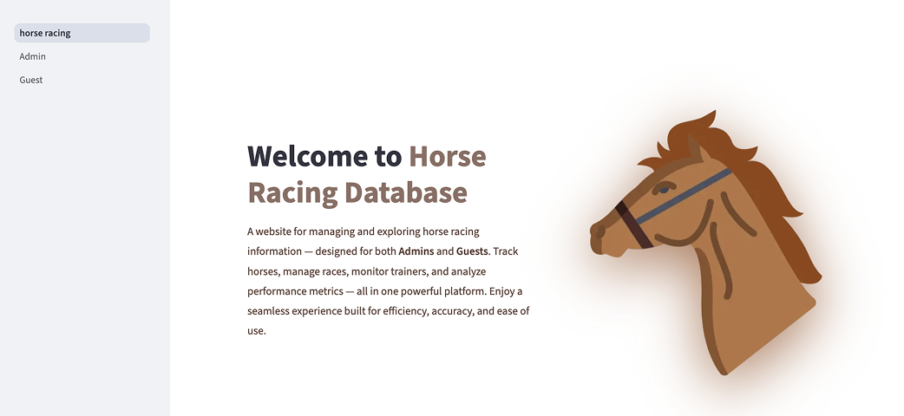

# 🐎 Horse Racing Database System

## 📚 Course Information
- **Course:** ICS321 – Database Systems  
- **University:** King Fahd University of Petroleum & Minerals (KFUPM)  
- **Group Members:** Renad Elsafi & Joud Aljabri  
- **Semester:** Fall 2025 (251)

---

## 📘 Project Overview
This project implements a **Horse Racing Database System** using **MySQL** as the backend and a **Python (Streamlit)** interface as the frontend.

The system supports **two user roles**:
- 👨‍💼 **Admin**
- 👤 **Guest**

It manages and explores data about **horses, stables, owners, trainers, and races.**

### 🎯 The system demonstrates:
- Database design & normalization  
- SQL programming (**DDL & DML**)  
- Procedural SQL (**Stored Procedures & Triggers**)  
- Python ↔ MySQL integration through **Streamlit**

---

## 🧩 Features

### 👨‍💼 Admin Functions
- ➕ Add a new race with results  
- ❌ Delete an owner and all related information *(via stored procedure)*  
- 🏇 Move a horse from one stable to another  
- ✅ Approve a new trainer to join a stable  

### 👤 Guest Functions
- 🔍 Browse horses by owner’s last name *(with trainer details)*  
- 🏆 View trainers who have trained **winning horses (1st place)**  
- 💰 View **total prize winnings per trainer**, sorted by total amount  
- 🗺️ List **race tracks, race counts, and total participants per track**  

---

## 🧠 Database Schema
### Main Tables
- Stable(stableId, stableName, location, colors)
- Horse(horseId, horseName, age, gender, registration, stableId)
- Owner(ownerId, lname, fname)
- Owns(ownerId, horseId)
- Trainer(trainerId, lname, fname, stableId)
- Race(raceId, raceName, trackName, raceDate, raceTime)
- RaceResults(raceId, horseId, results, prize)
- Track(trackName, location, length)
  
### Constraints & Relationships
- Each horse belongs to one stable.
- A horse can have multiple owners (many-to-many via Owns).
- Each trainer belongs to one stable.
- A race takes place on a track and can include multiple horses.
- Owners may own multiple horses across multiple stables.

## ⚙️ Implementation Details
#### 🧱 Backend
- Database: MySQL
- Procedural SQL:
- Stored Procedure → Deletes an owner and all related information.
- Trigger → Copies deleted horse info into an old_info table.
  
### 💻 Frontend
- Language: Python
- Framework: Streamlit
Libraries Used:
- streamlit → User interface
- mysql-connector-python → Database connection
- pandas → Data handling and display

